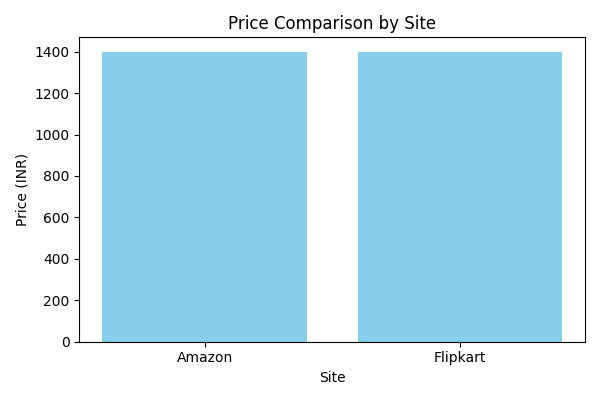

# Price Review Aggregator

## Overview

The **Price Review Aggregator** is a Python-based project that scrapes product data from e-commerce websites (e.g., Amazon and Flipkart) and aggregates the information into a CSV file. It also generates a bar chart comparing product prices across different platforms.

## Features

- Scrapes product details such as title, price, rating, and reviews from Amazon and Flipkart.
- Aggregates the scraped data into a CSV file (`aggregated_products.csv`).
- Generates a bar chart (`price_comparison.png`) to visualize price comparisons.

## Prerequisites

To run this project, ensure you have the following installed:

- Python 3.10 or higher
- Google Chrome browser
- ChromeDriver (compatible with your Chrome version)

## Installation

1. Clone this repository:

   ```bash
   git clone <repository-url>
   cd price_review_aggregator
   ```

2. Install the required Python packages:
   ```bash
   pip install -r requirements.txt
   ```

## Usage

1. Update the `urls` list in `src/main.py` with the product URLs you want to scrape.

2. Run the script:

   ```bash
   python src/main.py
   ```

3. After execution:
   - The aggregated product data will be saved in `aggregated_products.csv`.
   - A bar chart comparing product prices will be saved as `price_comparison.png`.

## Project Structure

```
price_review_aggregator/
│
├── aggregated_products.csv   # Output CSV file with aggregated product data
├── price_comparison.png      # Output bar chart comparing product prices
├── README.md                 # Project documentation
├── requirements.txt          # Python dependencies
├── src/                      # Source code directory
│   ├── __init__.py           # Package initializer
│   └── main.py               # Main script for scraping and data processing
```

## Dependencies

The project uses the following Python libraries:

- `selenium`: For web scraping
- `beautifulsoup4`: For parsing HTML content
- `pandas`: For data manipulation
- `matplotlib`: For data visualization

## Notes

- Ensure that the ChromeDriver version matches your installed Chrome browser version.
- Some websites may block scraping attempts. Use responsibly and adhere to the website's terms of service.

## License

This project is licensed under the MIT License. Feel free to use and modify it as needed.

## Sample Output

### Aggregated Data (CSV)

Below is an example of the data saved in `aggregated_products.csv`:

| Site     | Title                                                                                    | Price (INR) | Rating | Reviews |
| -------- | ---------------------------------------------------------------------------------------- | ----------- | ------ | ------- |
| Amazon   | boAt Rockerz 450, 15 HRS Battery, 40mm Drivers, Padded Ear Cushions, Integrated Controls | 1399        | 4.0    | 117,015 |
| Flipkart | boAt Rockerz 450 w/ 40mm Drivers, 15 HRS Playback, Soft Padded Earcups Bluetooth         | 1399        | 4.3    | 40,644  |

### Price Comparison Chart

The project generates a bar chart comparing product prices across different platforms. Below is the generated image:


